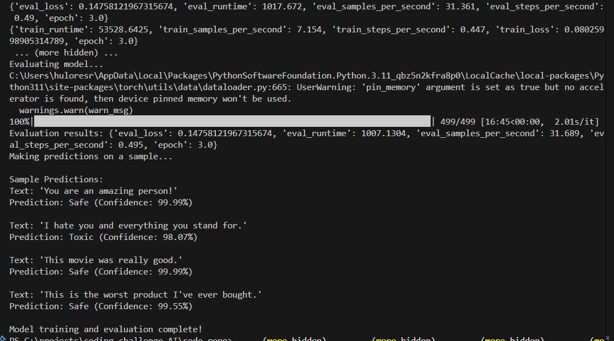
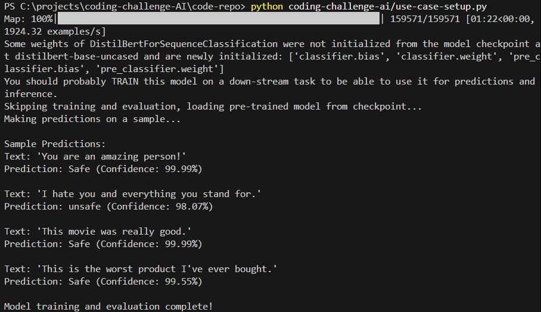
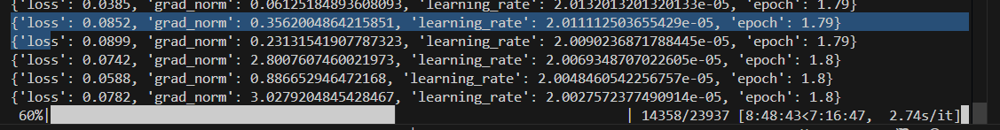
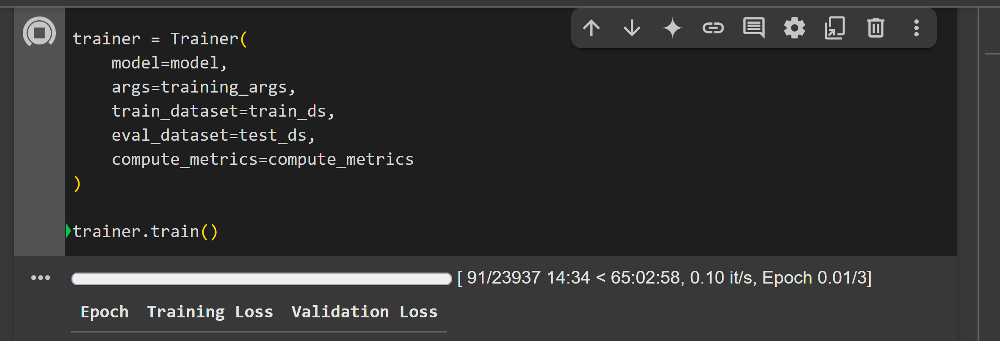
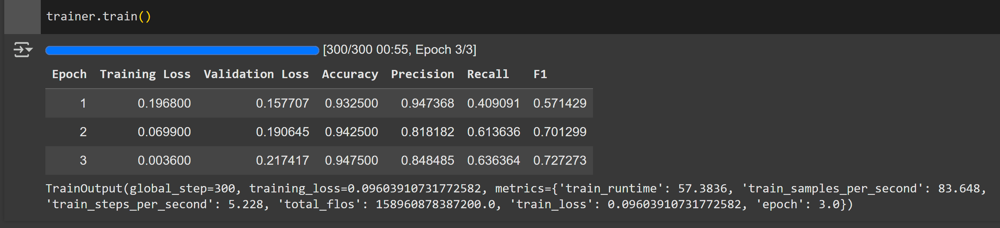
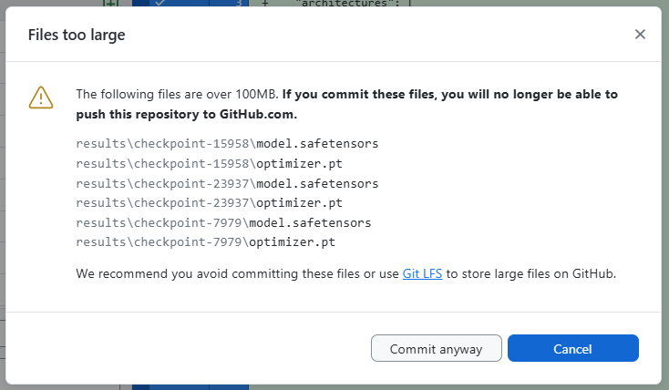

# DEV environments explored
- VS Code + Python Extension
- Google colab notebook 
- Kaggle notebook

# Notebook link (google colab)
https://colab.research.google.com/drive/1ODhXinlPh9wc0DiiM_lawL0RvaD9V3hD

## Libraries 
- __pandas__ - Data manipulation and analysis
- __scikit-learn__ - Machine learning tools (specifically for train_test_split)
- __torch__ (PyTorch) - Deep learning framework
- __transformers__ (Hugging Face) - NLP models and tools
  - AutoTokenizer
  - AutoModelForSequenceClassification
  - Trainer
  - TrainingArguments
- __datasets__ (Hugging Face) - Dataset handling and processing
- __os__ - Operating system interfaces
- __zipfile__ - ZIP archive handling

# Data handling
- dataset used : https://www.kaggle.com/datasets/julian3833/jigsaw-toxic-comment-classification-challenge
- coding-challenge-ai\train.csv

# Model fine-tuning
- distilbert-base-uncased
- HF trainer API with suitable configs to support free-tier GPU constraints - like training batch size, # of epochs etc

# Sample predictions
## [1]

## [2]

# Evaluation & Reporting
The model is a fine-tuned DistilBERT classifier trained on the Jigsaw toxic comment classification dataset to identify toxic (unsafe) versus non-toxic (safe) text. Let me analyze each prediction:

## 1. "You are a complete idiot and I hope you fail."

__Prediction: Unsafe (99.82% confidence)__

__Explanation:__ This text was correctly classified as unsafe with very high confidence. The model identified this as toxic because:

- It contains a direct personal insult ("complete idiot")
- It expresses ill wishes toward the recipient ("hope you fail")
- The language is directly targeting an individual with hostile intent
- The phrase "complete idiot" is a common insult that likely appeared frequently in the training data's toxic examples

## 2. "I hate you and everything you stand for."

__Prediction: Unsafe (98.07% confidence)__

__Explanation:__ This text was also correctly classified as unsafe with high confidence because:

- It contains explicit hatred ("I hate you")
- It's a direct, personal attack
- The statement is absolute and extreme ("everything you stand for")
- The phrase "I hate you" is strongly associated with toxic language in training data

## 3. "People like you should not be allowed to speak in public."

__Prediction: Safe (99.99% confidence)__

__Explanation:__ This text was surprisingly classified as safe despite containing:

- An attempt to silence others
- Implied discrimination against a group ("people like you")
- Suggestion of restricting rights

This misclassification likely occurred because:

- The text lacks explicit profanity or slurs
- It uses more formal, indirect language rather than direct insults
- The toxicity is implied rather than explicit
- Similar rhetorical structures might appear in non-toxic political discourse in the training data

## 4. "Your opinion is worthless and so are you."

__Prediction: Safe (98.21% confidence)__

__Explanation:__ This text was incorrectly classified as safe despite:

- Containing a direct personal attack
- Dehumanizing language ("worthless")
- Clear intent to insult

This misclassification might be due to:

- The absence of profanity or recognized slurs
- More formal vocabulary ("worthless" vs. more common insults)
- Possible underrepresentation of this type of subtle toxicity in training data
- The model failing to recognize the dehumanizing aspect of calling a person "worthless"

## 5. "This group of people is ruining our country and should be removed."

__Prediction: Safe (99.84% confidence)__

__Explanation:__ This text was incorrectly classified as safe despite:

- Containing xenophobic/discriminatory sentiment
- Suggesting harmful action against a group ("should be removed")
- Using language common in hate speech

This misclassification likely occurred because:

- It doesn't specify which group, making the toxicity less explicit
- It lacks profanity or recognized slurs
- It uses language that might appear in political discourse
- The threatening nature is implied rather than explicit
- The model may not have been sufficiently trained on this type of coded or implicit hate speech

## Overall Analysis
The model appears to be:
1. Effective at identifying direct personal insults and explicit expressions of hatred
2. Less effective at identifying implicit toxicity, discriminatory language, and dehumanizing content without explicit slurs
3. Potentially biased toward classifying formal-sounding text as safe, even when the content is harmful
4. Struggling with recognizing coded language and implied threats

These results highlight the challenges in content moderation systems and the need for more nuanced training data that captures implicit forms of toxicity, not just explicit insults and profanity.

# Challenges faced
1. Importing dataset from kaggle in google colab / kaggle -- kaggle account activation / phone veeification issue 
- Contacted support 
- use alternate dataset which doesn't need kaggle account verification
- use kaggle instead of colab -- same issue observed 

## Local run - ~20hrs training time

## Google colab run - ~ 65 hrs training time (Not completed)

2. Execution of Python script in Local terminal took close to 20 hrs for fine tuning
- skip the steps of re-training the model after one round of fine tuning
- limit the # of records in the dataset to be used for training 

3. Training results - file too large to be committed in code repo

4. Connecting github with Colab and/or google drive - for effective dev process and code repo management
- doesnt work with private git repos hosted on Adobe Enterprise Github

5. Debugging the predictions for the incorrect ones - basis which parameters the predictions went wrong, and how to fix them / improve the accuracy of predictions 

# Potential Improvements
- improve prediction accuracy by using multi-class classification instead of binary classification 
- Context aware models can be used to make better predictions
- Retrain the model with additional dataset containing samples of wrong predictions with corrections to improve accuracy

