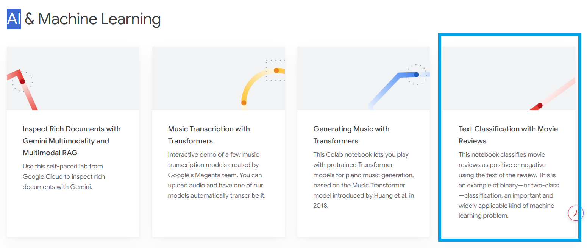
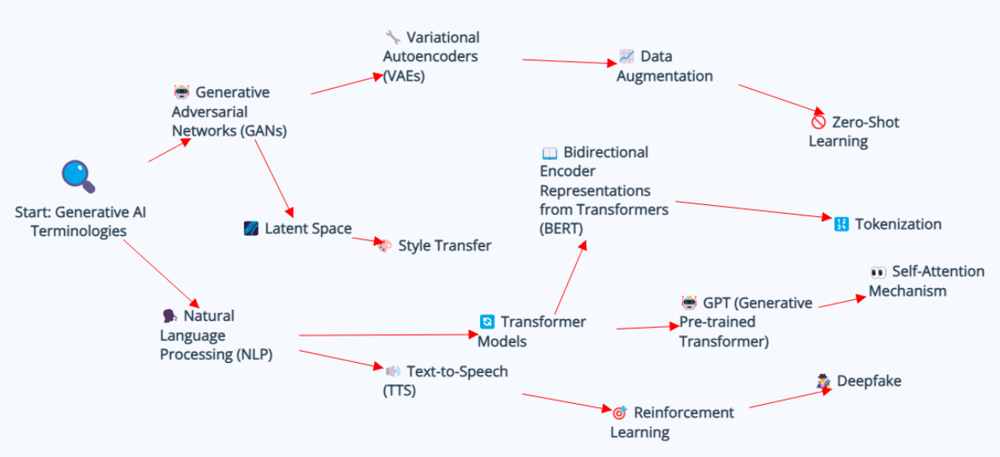

# Reference links
https://colab.google/notebooks/

https://colab.research.google.com/github/tensorflow/docs/blob/master/site/en/hub/tutorials/tf2_text_classification.ipynb

For Dataset - jigsaw toxic comment classification
https://www.kaggle.com/datasets?search=jigsaw+toxic+comment+classification

# Understanding terminologies

## Fine Tuning : 
adapting a pre-trained model to a particular task - through additional training

## Text Classifier :
A text classifier is a machine learning model that automatically assigns predefined labels or categories to text data based on its content. It’s widely used in natural language processing (NLP) tasks like:
- Spam detection (e.g., spam vs. not spam in emails)
- Sentiment analysis (e.g., positive, negative, neutral)
- Toxic comment classification
- Topic tagging (e.g., sports, politics, health)
- Language detection
### How It Works:
1. Input Text: The raw text you want to classify.
1. Preprocessing: Tokenization, stop word removal, etc.
1. Vectorization: Converting text into numerical form using methods like TF-IDF, word embeddings (Word2Vec, BERT), or one-hot encoding.
1. Model Training: Training a classifier like logistic regression, SVM, or deep learning models (e.g., LSTM, transformers).
1. Prediction: The trained model assigns a label to new/unseen text.

## Prompt Guardrails
Prompt guardrails are rules or constraints embedded in prompts or system instructions to ensure AI-generated outputs remain safe, relevant, and aligned with organizational or ethical standards. They help prevent:
- Harmful, biased, or inappropriate content
- Prompt injection or jailbreak attempts
- Off-topic or brand-inconsistent outputs
### How Prompt Guardrails Are Implemented
#### Text Classifier Layer:
Uses a fine-tuned model (like BERT, RoBERTa, or DistilBERT) to detect:
- Hate speech
- Harassment
- Threats
- NSFW content
Triggers warnings, redactions, or prompt blocking based on thresholds.
#### Rule-Based Filters:
- Regex or keyword patterns to block known bad inputs fast.
#### Contextual Filters:
- Look at both prompt and chat history to detect contextually inappropriate prompts.
#### Response Shaping or Intervention:
Instead of blocking, the system might warn the user or offer a safer rephrasing.

## Hugging face - datasets
high-level library that provides ready-to-use NLP and ML datasets with efficient tools for loading, streaming, preprocessing, and transforming large-scale datasets. It's part of the Hugging Face ecosystem and is often used alongside transformers.
### Key Features
- Easy access to hundreds of datasets (text, image, audio, etc.)
- Supports streaming large datasets without full download
- Fast and memory-efficient with Apache Arrow backend
- Built-in tokenization, filtering, and mapping
- Compatible with PyTorch, TensorFlow, and JAX

## Task framing
Task framing is the process of clearly defining your machine learning problem—what you want the model to learn, how the inputs and outputs are structured, and what type of learning applies. This is critical for choosing the right dataset, model architecture, and evaluation metrics.

## epoch 
An epoch is one complete pass through the entire training dataset by the model during training / fine-tuning.
- The model sees every training sample once.
- For large datasets, data is usually split into mini-batches.
- After each batch, model weights are updated via backpropagation.
- After all batches in an epoch, the model has had one full look at the data.
